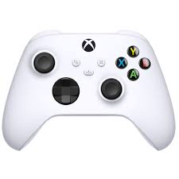

# 🎮 Сайт Xbox

Учебный проект — лендинг игровой вселенной Xbox. Стильный, тёмный сайт с информацией о консолях, играх и возможностях Xbox.

## 🚀 Демо

[Смотреть на GitHub Pages](https://твой-username.github.io/xbox-site)

## 🛠 Стек технологий

- **HTML5** — семантическая вёрстка (`<header>`, `<main>`, `<section>`, `<article>`, `<footer>`)
- **CSS3** — Flexbox, Grid, анимации, адаптивная вёрстка
- **БЭМ** — именование классов по методологии БЭМ

## 📸 Скриншот



## 📂 Структура

```
сайт Xbox/
├── index.html            # Главная страница
├── css/
│   └── style.css         # Стили
├── assets/
│   └── images/           # Изображения
│       ├── gamepad-black.jpg
│       ├── gamepad-white.jpg
│       ├── game-card-*.jpg
│       └── favicon.svg
└── README.md             # Описание проекта
```

## ✨ Особенности

- 🌙 Тёмная тема с зелёными акцентами (Xbox Style)
- 📱 Полностью адаптивная вёрстка (десктоп → планшет → телефон)
- 🎯 Плавная навигация по якорям
- 🖼 Анимация и hover-эффекты
- 📐 Чистая семантическая структура

---

*Учебный проект. Все права на бренд Xbox принадлежат Microsoft Corporation.*
