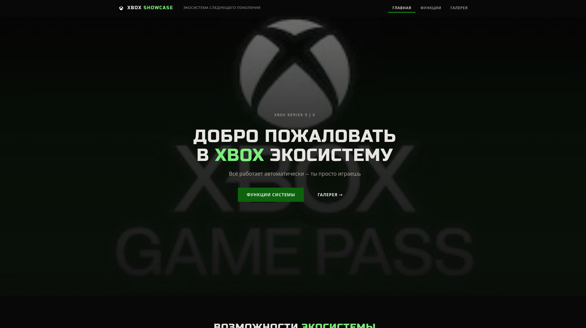

# 🎮 Xbox Showcase

Учебный проект — лендинг в стиле официального сайта Xbox (xbox.com). Тёмная тема, плоский дизайн, авто-слайдер и интерактивная панель статусов.



## 🔗 Репозиторий

[github.com/programmerandpersonallive/xbox-site](https://github.com/programmerandpersonallive/xbox-site)

## 🛠 Стек технологий

- **HTML5** — семантическая вёрстка (`<header>`, `<main>`, `<section>`, `<article>`, `<figure>`, `<footer>`)
- **CSS3** — Flexbox, Grid, кастомные переменные, адаптивная вёрстка, flat дизайн
- **JavaScript** — авто-слайдер (carousel), typewriter, анимированный счётчик, активная навигация
- **Google Fonts** — Russo One (заголовки) + Chakra Petch (текст)

## 📂 Структура

```
сайт Xbox/
├── index.html            # Главная страница
├── css/
│   └── style.css         # Стили (flat design, Xbox-стиль)
├── js/
│   └── main.js           # Скрипты: слайдер, тайпер, счётчик
├── assets/
│   └── images/           # Изображения
│       ├── GamePass.jpg
│       ├── CloudeGaming.jpg
│       ├── CrossplayMultiplatform.jpg
│       ├── Icon.png
│       ├── QuikeResume.jpg
│       ├── Site.png
│       ├── gamepad-black.jpg
│       ├── gamepad-white.jpg
│       ├── logo.svg
│       └── favicon.svg
└── README.md
```

## ✨ Особенности

- 🎮 **Авто-слайдер** — циклическая карусель функций Xbox (4 секции, авто-пролистывание каждые 4 сек)
- ⌨️ **Typewriter** — автоматическая печать названий технологий Xbox
- ⚡ **Счётчик сессий** — анимированный счётчик с ease-out анимацией
- 🌙 **Тёмная тема** — глубокий чёрный `#0a0a0a`, акцент Xbox Green `#107c10`
- 📱 **Адаптивность** — десктоп → планшет → телефон
- 🏢 **Дизайн в стиле Xbox.com** — плоский, прямоугольный, все заголовки CAPS

## 🚀 Запуск

Просто открой `index.html` в браузере.

---

*Учебный проект. Все права на бренд Xbox принадлежат Microsoft Corporation.*
